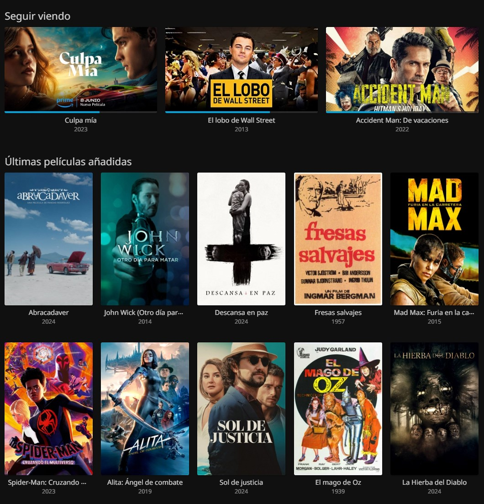

# LordFlix -  

 

 

## 🎞️ LordFlix
**LordFlix** is a multimedia center that automatically downloads and serves the latest movies and/or series of the moment. It acts similar to *Netflix*, *Prime Video* etc. but **better**. In addition, with proper configuration you can access the content **from anywhere in the world**.

This guide is prepared to set up a media center from the beginning. Including the basic hardware requirements, going through the server configuration and finally configuring the *-arr* software that will run the media center.

Once mounted, **this media center can be run from any existing device**. Computers, TVs, tablets, phones, etc. All you have to do is download the “Jellyfin” client which can be found in the Google Store, Apple Store, Amazon Fire TV Stick, and multiple TV OS. From the computer/laptop it would be simply by accessing a URL.

It may seem that the execution of this tutorial is somewhat complex, but everything is properly documented so that anyone can do it. Cheer up!

## ⚙️ Hardware

A complete kit including case, power supply and micro sd card is recommended. In addition, an internal hard disk will be added to store the contents of the media server. Don't be cheap and buy the recommended set, you beggar. Besides the fact that you will get a better return, I will get more commission, since of course the links are affiliate links. If you are poor you can choose the cheap version.

### Recommended (Giga Chad Version) - *265€ Approx.* 

 - [Raspberry PI4 8GB](https://amzn.to/3Yw64ol)
 - [HDD 3.5 4TB](https://amzn.to/4dSOcIV)
 - [3.5-inch HDD Enclosure](https://amzn.to/4fbvoWc)

### Cheaper (Dirty Rat Version) - *175€ Approx.* 
 
 - [Raspberry PI4 4GB](https://amzn.to/3Yuo6rf)
 - [HDD 3.5 2TB](https://amzn.to/48idO0L)
 - [3.5-inch HDD Enclosure](https://amzn.to/4hdaeZK)

**Any unused raspberry you have at home along with any external hard drive lost in a drawer can work in this tutorial. I highly recommend that you have at least 2GB of RAM and 2TB of disk space.*

***The better the hardware used, the more clients/persons can consume the media center at the same time.*

## 💻 Software

In this tutorial we will install the **Raspberry Pi OS Lite** *(headless)* version. Headless doesn't mean that you have to rip anyone's head off, you moron. It means we're going to run the server from another computer. In the following link you will find the installer needed to prepare the operating system in the micro sd.

  - [Raspberry Pi OS Lite](https://www.raspberrypi.com/software/)

  *You need [help](guides/installing-os.md)?*

### Basic configuration

Access the server to perform the following configurations. **The order is important.** I'm not joking. It is.

*You need [help](guides/connect-via-ssh.md)?*

 1. [Configure SWAP Memory](guides/configure-swap.md)
 2. [Setup external HDD](guides/setup-ext-hdd.md)
 3. [Setup Docker](guides/setup-docker.md)
 4. [Setup maintenance scripts](scripts/README.md)

## 🟢 Run LordFlix

There are several setups (and there will be some more in the future) depending on the configuration you want to make. Each of them has a short tutorial with explanations.

- [Standard Setup](docker-compose/README.md)
  - Do you want more privacity? [Setup with VPN](docker-compose/vpn/README.md)
  - Want series in addition to movies? Wait for it or buy Netflix.
